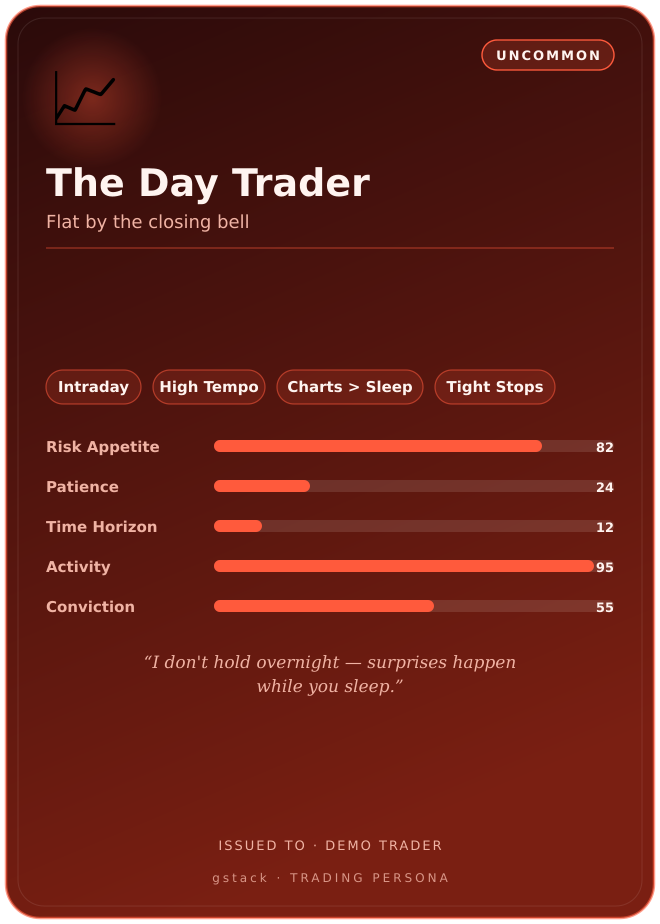

# Trading Persona Cards

Generate collectible-style **persona cards** for predefined trader archetypes —
shareable graphics that capture each trading style's temperament, traits, and
stat profile.

Each card renders as a standalone **SVG** (no browser required) and can be
rasterized to **PNG** via Playwright (already a gstack dependency).



## Quick start

```bash
# Write an SVG for every archetype → trading-cards/out/
bun run trading-cards/generate.ts

# Also rasterize each card to PNG (needs Playwright Chromium)
bun run trading-cards/generate.ts --png

# One archetype, stamped with an owner name
bun run trading-cards/generate.ts --only hodler --name "Alice"

# See all archetype ids
bun run trading-cards/generate.ts --list
```

If `--png` is requested but Chromium isn't installed, the generator still writes
the SVGs and prints a hint (`bunx playwright install chromium`).

## Options

| Flag             | Description                                              |
| ---------------- | -------------------------------------------------------- |
| `--png`          | Also rasterize each card to PNG (2× scale, transparent). |
| `--only <id>`    | Generate a single archetype (or pass the id bare).       |
| `--name <name>`  | Stamp an owner: `ISSUED TO · NAME`.                      |
| `--out <dir>`    | Output directory (default `trading-cards/out`).          |
| `--width <px>`   | Card width in px; height is the 5:7 trading-card ratio.  |
| `--list`         | List available archetype ids.                            |
| `-h`, `--help`   | Show help.                                                |

## Archetypes

| Sigil | Archetype              | Style                                  |
| ----- | ---------------------- | -------------------------------------- |
| 📈    | The Day Trader         | Intraday, flat by the close            |
| ⚡    | The Scalper            | Sub-minute, hundreds of tiny wins      |
| 🌊    | The Swing Trader       | Multi-day trends and pullbacks         |
| 🚀    | The Momentum Trader    | Breakouts, relative strength           |
| 🎯    | The Contrarian         | Mean reversion, buys the panic         |
| 🤖    | The Quant              | Systematic, backtested, emotionless    |
| 💎    | The HODLer             | Diamond hands, max conviction          |
| 🏛️    | The Long-Term Investor | Fundamentals, compounding, buy & hold  |

Every persona is scored on five axes (0–100): **Risk Appetite, Patience,
Time Horizon, Activity, Conviction** — rendered as stat bars on the card.

## Architecture

```
trading-cards/
├── personas.ts   # Predefined archetype data — single source of truth
├── card.ts       # Pure SVG renderer: Persona → SVG string (no deps)
├── generate.ts   # CLI: writes SVG, optional PNG via Playwright
└── out/          # Generated cards (PNGs gitignored)
```

To add an archetype, append an entry to `PERSONAS` in `personas.ts` — it gets a
card automatically. The renderer is pure and side-effect free, so it's trivial
to embed elsewhere (web app, API) by importing `renderCardSVG`.
